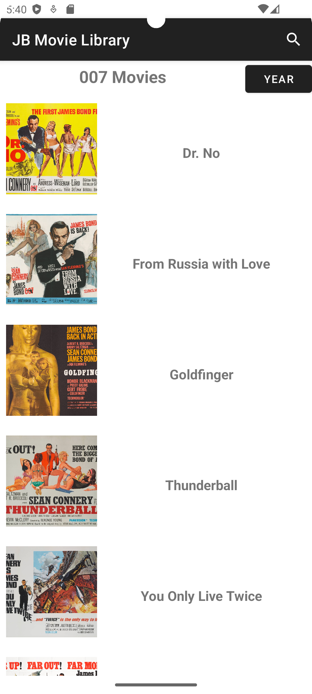
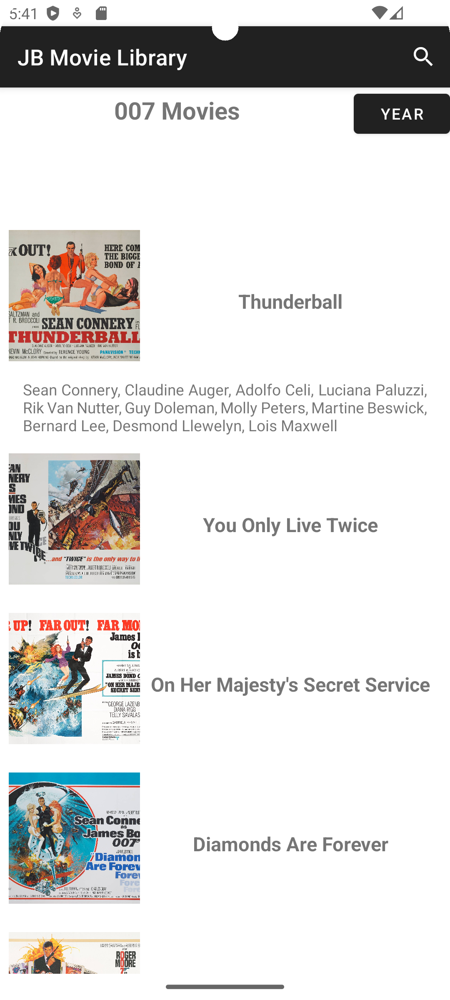
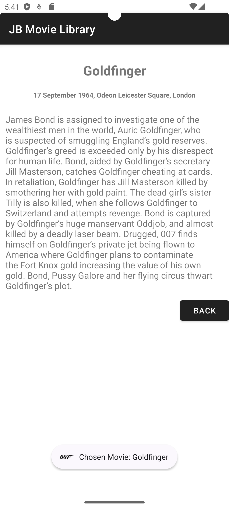

# James Bond Movies RecyclerView Example

This Android project demonstrates the use of `RecyclerView` with two activities, showcasing a list of James Bond movies along with their details, release dates, a search bar for filtering movies, and swipe-to-delete functionality.

## Features

- **RecyclerView** to display a list of James Bond movies.
- **Two Activities**:
  - **MainActivity**: Displays the list of movies with a search bar.
  - clickable Image for the cast and clickable Title for the details
  - **DetailActivity**: Shows detailed information about a selected movie.
- **Search Functionality**: Filter movies by their title.
- Ascending - Descending Button
- **Swipe-to-Delete**: Remove movies from the list with a swipe gesture.

## Screenshots

<div style="display: flex; gap: 20px;">

  <div style="text-align: center;">
    
    <div style="font-size: 10px; color: #555;">Main Activity</div>
  </div>

  <div style="text-align: center;">
    
    <div style="font-size: 10px; color: #555;">Main Activity (cast selection)</div>
  </div>

  <div style="text-align: center;">
    
    <div style="font-size: 10px; color: #555;">Detail Activity</div>
  </div>

</div>


## Getting Started

### Prerequisites

- Android Studio 4.0 or later
- Gradle 6.1.1 or later

### Installation

1. Clone the repository:
    ```sh
    git clone https://github.com/XaplanterisNikos/RecyclerViewExample
    ```
2. Open the project in Android Studio.
3. Build and run the project on an emulator or physical device.

## Project Structure

```plaintext
RecyclerViewExample/
├── app/
│   ├── src/
│   │   ├── main/
│   │   │   ├── java/com/example/recyclerviewexample/
│   │   │   │   ├── adapter/
│   │   │   │   │   └── MyAdapter.java
│   │   │   │   ├── model/
│   │   │   │   │   └── Movie.java
│   │   │   │   ├── activities/
│   │   │   │   │   ├── MainActivity.java
│   │   │   │   │   ├── DetailActivity.java
│   │   │   │   └── data/
│   │   │   │       └── MovieData.java
│   │   │   ├── res/
│   │   │   │   ├── layout/
│   │   │   │   │   ├── activity_main.xml
│   │   │   │   │   ├── activity_detail.xml
│   │   │   │   │   ├── movie_row.xml
│   │   │   │   ├── drawable/
│   │   │   │   │   └── png files
│   │   │   │   ├── values/
│   │   │   │       └── strings.xml
│   └── build.gradle
└── build.gradle
